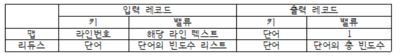
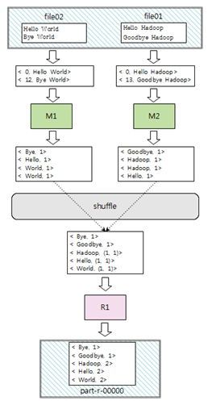

# 📆 Hadoop-wordCount

##📝 개요
wordCount는 MapReduce 프로그래밍 일종으로 데이터를 <key,value>쌍으로 변환하여 처리하는 프로그래밍입니다.

##📂 MapReduce input/output
- 데이터 모델
1) map의 입력과 출력, reduce의 입력과 출력 레코드 모두 <key,value>
2) 키와 밸류로 구성된 데이터를 입력받아 가공/분류한 후, 새로운 키와 밸류로 구성된 목록을 출력
~~~
map : <k1,v1> -> list(<k2,v2>)
~~~
3) 키를 기준으로 Grouping 된 value의 목록을 입력 데이터로 받아, value 목록에 대한 집계 연산을 수행하여 새로운 키로 Grouping된 새로운 value을 생성
~~~
reduce : <k2,list(v2)> -> <k3,v3> or list(<k3,v3>)
~~~

##📂 WordCount
- 주어진 입력 파일들에 있는 텍스트를 단어별로 빈도수를 계산하는 프로그램

1) map
- 파일의 각 라인을 단어로 분리 한 후, <word,1> 데이터를 생성
2) 셔플 단계 
- 맵 단계의 출력을 파티션한 후, 같은 키를 갖는 레코드들을 그룹핑한 후 각 리듀서로 보냄
3) 리듀스 단계
<word,빈도수 리스트>를 입력받아 <word, 빈도수 합계>를 출력

##🖌 동작 예제

##📝 MapReduce framwork data flow
1) map phase
- 대용량 입력 데이터 파일을 입력 스플릿 조각으로 분리
- 스플릿별로 하나의 맵 테스크가 생성
- map task의 출력 데이터는 슬레이브 노드의 로컬 디스크에 맵의 출력키를 기준으로 정렬되어 임시 저장됩니다.

2) suffle phase
- map task의 출력데이터가 reduce task에게 전달되는 중간 과정
- 맵 출력등 중 같은 키를 갖는 데이터는 동일한 리듀서로 보내집니다.
- suffling : 하나의 Map Task가 종료되면 파티션 번호별로 sorting된 하나의 디스크 파일이 만들어지고, 이를 reduce task가 자기에게 해당하는 파티션 번호에 해당하는 데이터만 HTTP를 통해 읽어가는 것.

3) Reduce phase
- 사용자가 정의한 Reduce 함수를 레코드 단위로 실행
- Reduce 함수는 입력키 별로 입력값의 목록을 집계하여 출력키와 출력 벨류의 쌍으로 만듭니다.
- 리듀서 개수만큼 출력파일이 생성되며 HDJS에 저장합니다
(파일이름 : part-r-nnnn)

## 📈 Java MapReduce Programing

#### java MapReduce 클래스
- 라이브러리
~~~ 
org.apache.hadoop.mapreduce
~~~
- Map Class
~~~
public class MyMapper extends Mapper<K1, V1, K2, V2> {
  K2 k2 = new K2();
  V2 v2 = new V2();
  @override 
  public void map(K1 key, V1 value, Context context) {
    ...
    context.write(k2, v2);
  }
}
~~~

- Reduce Class
~~~
public class MyReducer extends Reducer<K2, V2, K3, V3>{
  K3 k3 = new K3();
  V3 v3 = new V3();
  @override 
  public void reduce(K2 key, Iterable<V2> values, Context context){
    ...
    context.write(k3, v3);
  }
}
~~~

- Driver Class
~~~
public class MyDriver {
  public static void main(String[] args) throws Exception{
    Configuration conf = new Configuration();
    Job job = Job.getInstance(conf, 이름);
    job.setJarByClass(...);   //잡 클래스 지정
    job.setMapperClass(...);   //맵 클래스 지정
    job.setCombinerClass(...);   //컴바이너 클래스 지정
    job.setReducerClass(...);   //리듀서 클래스 지정
    job.setOutputKeyClass(...);  //리듀서의 출력 키 타입 지정
    job.setOutputValueClass(...);  //리듀서의 출력 밸류 타입 지정
    job.setInputFormatClass(...);  //입력포맷 지정 
		job.setOutputFormatClass(...);  //출력포맷 지정 
    FileInputFormat.addInputPath(job, Path 객체);  //입력 디렉터리 위치(HDFS)
    FileOutputFormat.setOutputPath(job, Path 객체);  //출력 디렉터리 지정(HDFS) 
    System.exit(job.waitForCompletion(true) ? 0 : 1);
  }
}
~~~